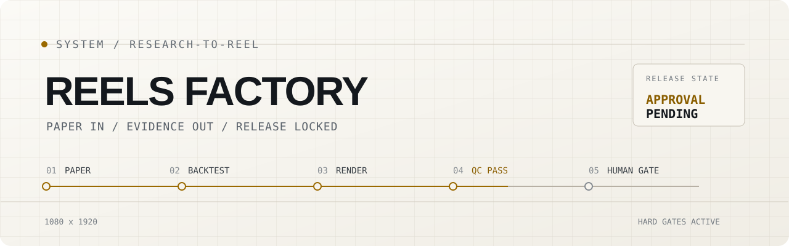
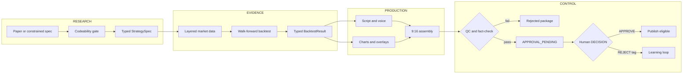

<picture>
  <source media="(prefers-color-scheme: dark)" srcset="assets/banner-dark.svg">
  
</picture>

# Reels Factory

Reels Factory turns a quant paper into a QC-gated, 1080 x 1920 research reel.
It constrains the paper to a vetted strategy shape, runs a walk-forward backtest,
writes and renders the result, then holds the package for a human decision.

The difficult part is not making an MP4. It is keeping every spoken and visible
number traceable to one typed result while independent checks can still stop the
release. No package becomes publishable merely because the render completed.

## One paper, one measured result

<table>
  <tr>
    <td width="36%" align="center">
      
      <br><sub>31.8-second reel shown at 3x speed</sub>
    </td>
    <td width="64%">
      <code>RUN / OFFLINE FIXTURE</code><br><br>
      <strong>Paper</strong><br>
      Two Centuries of Trend Following, arXiv:1404.3274<br><br>
      <strong>Test window</strong><br>
      2004-2026, bundled sample data<br><br>
      <strong>Observed result</strong><br>
      8.71% CAGR / 0.83 Sharpe / -23.68% max drawdown<br><br>
      <strong>Benchmark</strong><br>
      SPY buy-and-hold / 10.89% CAGR<br><br>
      <strong>Gate</strong><br>
      <code>QC PASS / 0 FAILURES</code>
    </td>
  </tr>
</table>

Those numbers come from a verified offline run of the bundled fixture, not from
the paper's claimed performance. The sample-data result is explicitly marked
`survivorship_limited: true`. The content is educational and is not financial
advice.

## The system



The contracts move in one direction:
`Paper -> StrategySpec -> BacktestResult -> Insight -> Script -> ReelPackage`.
Machine-readable JSONL logs attach every stage to a `run_id`.

### What can stop a release

- [`extract.py`](extract.py) rejects papers that do not map to a supported
  momentum, mean-reversion, crossover, pairs, calendar, factor-sort, or
  volatility shape.
- [`qc.py`](qc.py) compares rendered overlay values with the backtest result and
  checks frame zones, media duration, codecs, audio, disclaimer text, and
  prohibited advice language.
- [`factcheck.py`](factcheck.py) checks numerical claims against `BacktestResult` independently
  of the renderer. Optional online LLM checking is an additional pass; offline runs
  never call it, even when a provider key is present in the environment.
- [`package.py`](package.py) writes `APPROVAL_PENDING` only after QC passes.
  Publishing also checks the approval ledger, so a render alone is insufficient.
- [`tools/redteam_test.py`](tools/redteam_test.py) proves that doctored numbers
  and advice phrases fail the gate.

## Run it offline

Python 3.12 and FFmpeg with `libx264` and `aac` are required. The public clone
includes the paper, nine sample parquet files, fonts, and strategy fixture. It
does not include the optional Piper or Kokoro model files.

```powershell
python -m pip install -r requirements.txt
python tools/make_bed.py
python run.py --doctor
python run.py --dry-run --vertical high_finance
```

The verified fixture run finishes without network access or API keys. If no
local TTS model is installed, it falls back to captions-only narration; the
generated bed still gives the QC gate a valid audio stream. Outputs appear under
`out/<slug>/` as an MP4, cover, caption, metadata, and, on a passing run, an
`APPROVAL_PENDING` file.

Keep this run local. `--dry-run` uses bundled data and excludes online TTS and LLM fact-checking; adding `--tts-online` explicitly allows an online voice provider. The doctor reports optional local voice models separately. Avoid configuring live IBKR or publishing credentials when verifying an offline clone.

Useful isolated checks:

| Command | Scope |
|---|---|
| `python run.py --check data` | Load the bundled parquet series |
| `python run.py --check backtest` | Run and print the fixture backtest |
| `python run.py --check chart` | Render the progressive chart and overlays |
| `python run.py --check package` | Build one package; return nonzero if QC fails |
| `python tools/redteam_test.py` | Exercise deliberate QC failures |

Live harvesting, online TTS, IBKR, LLM review, and Instagram publishing are
optional integrations. Their credentials belong in an untracked `.env`, never
in source.

## Read the output

```text
out/<slug>/
  <slug>.mp4       rendered reel
  cover.png        cover image, when thumbnail generation succeeds
  caption.txt      caption, alt text and optional audio note
  meta.json        measured metrics, data source, duration and QC failures
  APPROVAL_PENDING only present on a passing package
```

Inspect `meta.json` before treating a rendered file as ready. A failed package remains inspectable with `qc_passed: false`; `python run.py --check package` reports failure through its exit status. `APPROVAL_PENDING` requests review and is not approval to publish.

The working evidence stays under `state/work/<slug>/`, including the chart's `overlays.json`, assembled media and intermediate captions. Run logs use `state/runs.jsonl`; `state/ledger.db` records run and reel state. These generated paths are ignored. Dry runs also update the tracked `state/used_topics.json`, so preserve or review that change separately from source changes.

Regression checks for the bundled result, rejected package exit status and offline provider isolation:

```sh
python -m unittest discover -s tests -v
```

The doctor, stage checks and red-team run validate the local fixture. They do not verify live harvesting, provider quality, a broker session or Instagram publishing. Publishing requires credentials and a recorded human decision; no account or publishing step is part of the offline example.

## How the repository is structured

| Area | Responsibility |
|---|---|
| `contracts.py`, `extract.py`, `data.py`, `backtest.py` | Research constraints and evidence |
| `insight.py`, `script.py`, `voice.py`, `charts.py` | Editorial and visual production |
| `assemble.py`, `caption.py`, `cover.py`, `audio.py` | Media assembly |
| `qc.py`, `factcheck.py`, `compliance.py`, `review.py` | Release controls |
| `package.py`, `ledger.py`, `feedback.py` | Approval state and learning loop |
| `assets/sample/`, `state/marketdata/sample/` | Reproducible offline fixture |

The runtime directories `out/`, `state/work/`, and local voice models are
deliberately excluded. The music bed is reproducible with
[`tools/make_bed.py`](tools/make_bed.py).

## Contributing

Keep changes evidence-first. Add a fixture when introducing a strategy shape,
keep render values derived from `BacktestResult`, and add a failing red-team case
before changing a gate. Run the staged checks and the red-team test before
opening a pull request.

Design tokens, layout zones and release behavior are recorded in [DESIGN.md](DESIGN.md).

MIT licensed. See [`LICENSE`](LICENSE).
