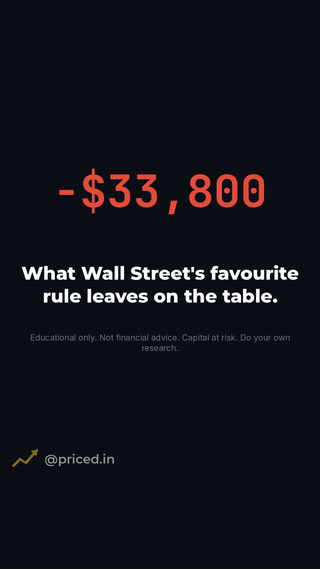
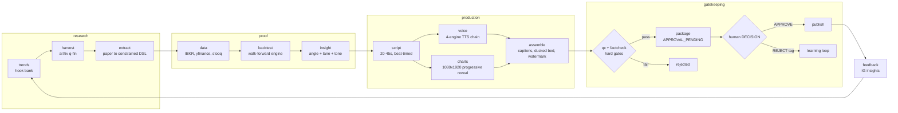
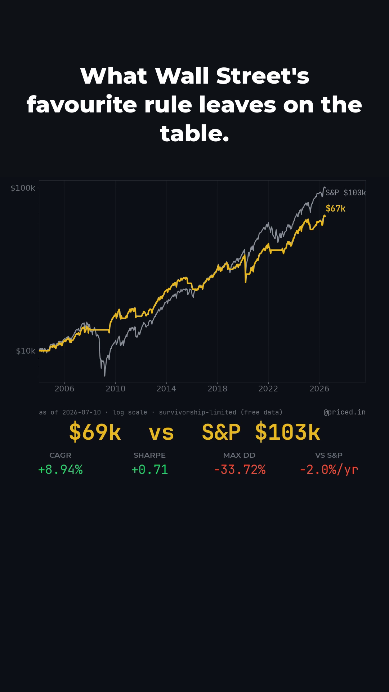

# Reels Factory

**A research pipeline that happens to publish to Instagram.**
Reads real quant-finance papers, backtests the strategy on real market data, and
packages the *result* as a branded 9:16 reel- voiced, captioned, QC-gated, and
blocked from posting until a human approves it.


The reel on the right was built by one command from a bundled arXiv paper
(Lempérière et al. 2014, *Two Centuries of Trend Following*), with no network and no
API keys. The research loop is the product; the video is the packaging.

## The honesty system

Finance content that misquotes its own numbers is worse than no content. Two
**independent** gates- written as separate code paths so one bug can't silently
pass both- stand between a backtest and a published frame:

1. **QC by construction** (`qc.py`): every number rendered on screen comes from an
   `overlays.json` the chart renderer emits as ground truth. QC asserts exact
   equality with the `BacktestResult`- no OCR, no "close enough".
2. **Independent fact-check** (`factcheck.py`): a separate pass re-derives every
   spoken and written claim from the backtest or the paper, with an optional
   LLM semantic re-read layered on top.

Plus the paranoid extras:

- **Zone discipline**- `layout.py` partitions the 1080x1920 frame into exclusive
  bands (captions / watermark / top-safe); QC pixel-diffs each band and fails the
  reel if any renderer bleeds into reserved space.
- **Data provenance**- IBKR (point-in-time) → yfinance → stooq → bundled parquet,
  and any fallback stamps **survivorship-limited** on the chart itself. The honesty
  gate always beats the budget rule.
- **Red-team regression** (`tools/redteam_test.py`)- a doctored overlay and an
  injected advice-phrase MUST fail QC, or the build breaks.
- **Approval-gated publishing**- every reel lands as `APPROVAL_PENDING`; nothing
  touches the Instagram API until a human writes `APPROVE` into a `DECISION` file.
  Rejection tags (`weak-hook`, `numbers-dull`, ...) feed back into the planner.

## Pipeline



34 modules, ~4,000 lines, typed end-to-end: every stage passes a Pydantic contract
(`Paper → StrategySpec → BacktestResult → Insight → Script → ReelPackage`), and every
run logs machine-readable JSONL keyed by `run_id`.

## Voice: a four-engine fallback chain

| Engine | What it brings | When |
|---|---|---|
| **Chatterbox** (Resemble AI) | SOTA quality | CUDA available |
| **Kokoro-82M** (ONNX) | ~5x realtime on CPU, fully offline | default |
| **edge-tts** | real word-boundary timings for karaoke captions | online |
| **Piper** | bundled offline fallback | always works |

Degrades gracefully to `pyttsx3` and finally captions-only- a dry run on a bare
machine still produces a complete, voiced reel.

## Papers never become arbitrary code

`extract.py` maps papers onto a fixed menu of vetted strategy shapes (momentum,
mean-reversion, crossover, pairs, calendar, factor sort, vol) behind a
`codeability_gate()`. If a paper doesn't fit a shape the pipeline can honestly
test, it's rejected- not improvised.

## Quick start

```
python run.py --doctor     # preflight: ffmpeg, fonts, data, TTS, encoders
python run.py --dry-run    # full offline build from the bundled paper fixture
```

`out/<slug>/` gets the mp4, cover, caption.txt, meta.json, and an
`APPROVAL_PENDING` flag. Other entry points:

| Command | Does |
|---|---|
| `run.py --batch N` | live: harvest arXiv q-fin, build N reels into the buffer |
| `run.py --check data\|backtest\|chart\|package` | one stage, isolated, asserted |
| `run.py --refresh-trends` | rebuild the hook bank |
| `run.py --pull-insights` | IG insights → performance report → hook re-scoring |
| `run.py --approve-scan` | ingest `out/*/DECISION` files into the ledger |

## Sample output

<p>
  
</p>

One brand system (dark, gold accent, tabular numerals), two account skins, and a
self-synthesized music bed (`tools/make_bed.py`)- licence-clean by construction.

## Also in here

- **A/B experiments** (`experiments.py`)- hook/cover/length/post-time arms, judged
  on a north-star metric once each arm has enough reels.
- **Cost ledger** (`costs.py`)- free-first accounting, warns at 80% of budget.
- **Streamlit dashboard** (`dashboard.py`)- read-only monitoring surface.
- **Community drafts** (`community.py`)- comment/DM replies in brand voice,
  approval-gated like everything else.

---

*Built by [Atul Kanodia](https://github.com/LolStar123). The IG accounts this feeds
are new- the factory was finished before the audience existed, which is either
discipline or optimism.*
